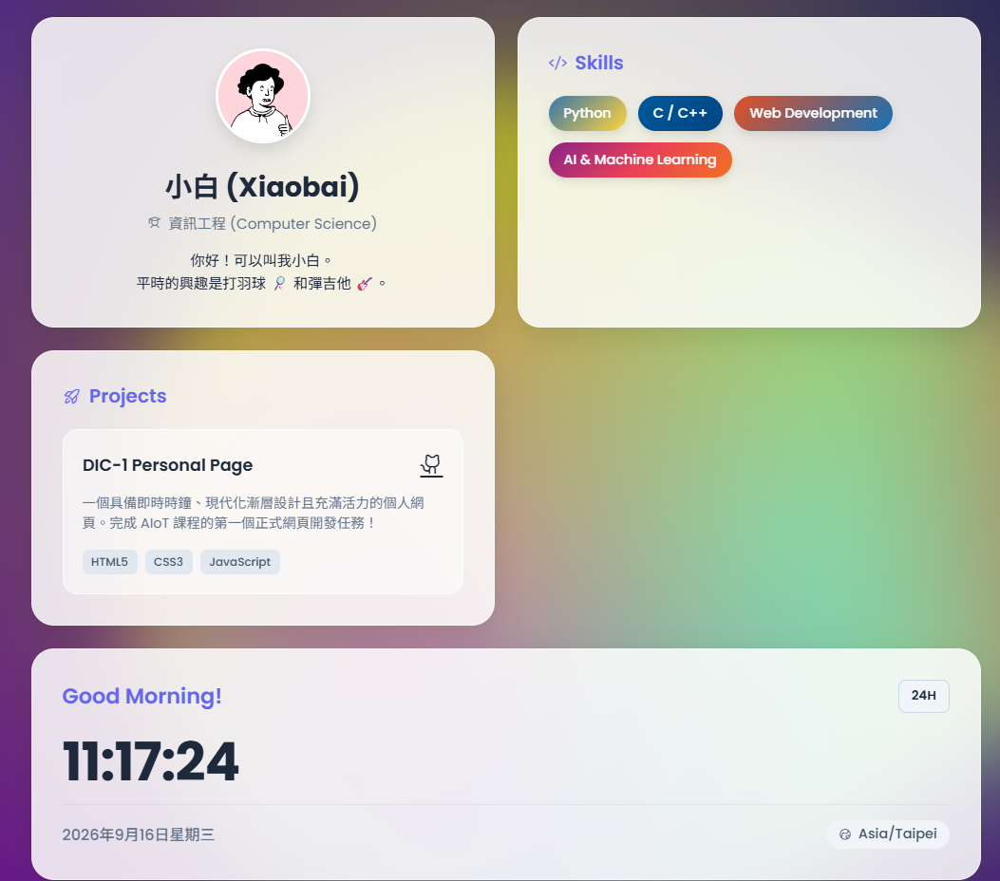

# Sh1ro - AIoT Personal Page

Welcome to my personal landing page! This is a simple, modern, and aesthetically pleasing web page that displays a personalized greeting and a real-time digital clock.

## 🌟 Live Demo

**[Click here to view the Live Demo](https://xwh1te0122.github.io/NCHU_AIoT_0916DIC/)**

## ✨ Features

- **Personalized Greeting**: A welcoming header displaying the user's name.
- **Real-time Clock**: Dynamically updates the current local time and date using JavaScript.
- **Modern UI Design**: Utilizes a Glassmorphism aesthetic for a sleek and premium look.
- **Responsive Layout**: Built with clean HTML and CSS to ensure it looks great on any device.

## 🛠️ Technologies Used

- **HTML5**: For semantic structure and content.
- **CSS3**: For styling, including modern effects like Glassmorphism and animations.
- **JavaScript**: For fetching and updating the real-time clock.
- **Google Fonts**: Utilizing the 'Outfit' font family for beautiful typography.
